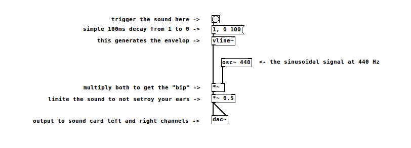

I just tested BFXR [http://www.bfxr.net/](http://www.bfxr.net/) yesterday and told myself "hey! I can do it with Pure Data! It could make a great tutorial for PD beginners". That's the motivation of this article.

# First sound

Let start with a basic sin waveform and a decay :

[download](pd/1.pd)

# Control the envelop

To emulate BFXR we will introduce GUI slider to control a full Attack/Sustain/Decay (ASD) envelop.

[download](pd/2.pd)

# Refactor controls

Our patch will get a lot of control and we need something simpler to maintain. We can make reusable modules with PD, these modules are called "Abstraction".

Abstraction can just contains processing object but could have a GUI as well. So lets make an abstraction for our controls, let's call it "control".

A nice feature in BFXR is the autoplay when value change. Lets implement it with PD. We will send a global message when a control value change as well.

[download](pd/control.pd)

Then we adapt our patch to use the control abstraction for the previously created ASD controls. Note that "control-change" message trigger the sound now!

[download](pd/3.pd)

It's a little ugly for now but since it is an abstraction, we could change it later.

# Save and load

Another nice feature is to be able to save and load settings. We will use the same data structure as FBXR in order to have compatibility and copy/paste from/to PD and FBXR!

TODO poc-loadsave doesn't work because of empty comma ... need serialization and symbol parsing ...

# Wave form visualization

Another nice feature is to view the wave form

[download](pd/4.pd)

OK enough with GUI, lets back to the sound!

# Control the frequency

[download](pd/5.pd)

# Wave forms

BFXR provides 9 waveforms :

* triangle
* sin
* square
* saw
* breaker
* tan
* whistle
* white
* pink

In order to control what we're doing we will add a visializer for our waveform shape.

[download](pd/6.pd)

Our path become messy and since we had a lot of things to add, we will refactor it a little by separating things.

We already know abstractions but pd provides another kind of custom object know as "subpatch" it is used to group object together to have cleaner patch.
Lets group logical things : 

* the ASD envelop
* the waveform sampler

Our ASD subpatch

And the result is really cleaner you don't think ?

[download](pd/7.pd)

## Saw

Let's create the saw signal and the waveform switch controller. Again to simplify, we will group all waveforms in a subpatch.

Here is our final patch :

[download](pd/8.pd)

Here is our waveforms selector :

Here is our previously sin. Note that we introduced a switch~ objetct. This ensure to not process audio when DSP is off. It saved some CPU.

And finally our saw signal :

## Triangle

TODOC

## Square

TODOC

## White

TODOC

## Others

TODO : ???

# More FX

Pitch modulation, ...etc

# Export to wave file

TODO

# Where to go from here ...

